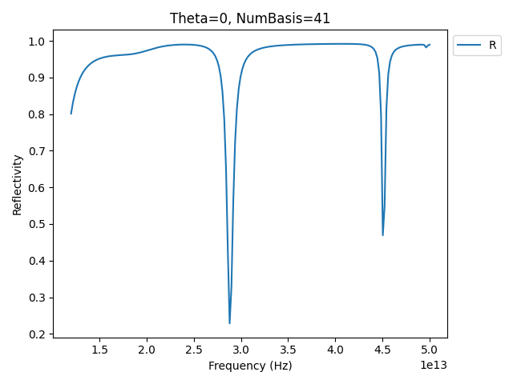
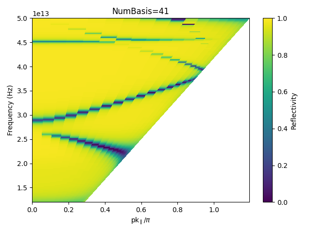

Tutorials
=========

Tutorial 1: A single, flat interface
-------------------------------------

In this example, we compute the reflection and transmission coefficients at a single, flat interface between a superstrate (incident medium) and a substrate. The example file can be found is under `examples/FresnelCoefficients.py <../../../examples/FresnelCoefficients.py>`_. The simulation can be run either in two or three dimensions, to demonstrate the syntax adjustments in creating the S\ :sup:`4` simulation object.

Once S4 has been installed, you should be able to import it, along with numpy and matplotlib.pyplot::

    import S4 as S4
    import numpy as np
    import matplotlib.pyplot as plt

As stated in the `S4 documentation <https://web.stanford.edu/group/fan/S4/units.html>`_, "S\ :sup:`4` solves the linear Maxwell’s equations, which are scale-invariant. Therefore, S\ :sup:`4` uses normalized units, so the conversion between the numbers in S4 and physically relevant numbers can sometimes be confusing." In order to clearly link the reduced units and the actual physical ones, we keep track of the speed of light (assumed to be 1 in S\ :sup:`4`)::

    c_const = 3e8

and the general scale is defined by the period of the lattice::

    a = 1 ## period, normalized units. This defines the length scale

So if we (arbitrarily) decide that `a` here is in units of micrometers, we can run the simulation at a wavelength of 1 micron by setting the following::

    lbda = 1e-6 ## say we compute at 1µm wavelength
    f = c_const/lbda ## ferquency in SI units
    f0 = f/c_const*1e-6 ## so the reduced frequency is f/c_const*a[SI units]

We pick the dimension of the simulation (2 or 3), then we set the lattice period and the number in-plane Fourier expansions order to be used (`S4.New <https://web.stanford.edu/group/fan/S4/python_api.html#S4.New>`_)::

    Dimension = 3 # 2 or 3

    if Dimension == 2:
        ### 2 dimensional simulation, 1D lattice
        S = S4.New(Lattice = a, 
                    NumBasis = 1)
    elif Dimension == 3:
        ### 3 dimensional simulation, 2D lattice
        S = S4.New(Lattice = ((a,0), (0,a)), 
                    NumBasis = 1)

In the case of a 2D simulation, the lattice is one-dimensional and has a simple period `a`. For the 3D simulation, the lattice dimension is two and we choose a square lattice 
of period `a` in both dimensions. Since the layer is unpatterned, we only need to compute the 0\ :sup:`th` plane wave order, and hence ``NumBasis=1`` is enough.

We then setup the main parameters of the simulation: the angle of incidence :math:`\theta`, and the refractive indices of the superstrate and substrate::

    theta = np.arange(0,89,2) ## angle of incidence in degree

    n_superstrate = 1 ## incident medium index
    eps_superstrate = n_superstrate**2 ## incicent medium permittivity
    n_substrate = 2 ## substrate index
    eps_substrate = n_substrate**2 ## substrate permittivity 

S\ :sup:`4` uses (possibly complex and anisotropic) permittivities instead of refractive index, which is used when declaring the materials used in the simulation (`S.SetMaterial <https://web.stanford.edu/group/fan/S4/python_api.html#S4.Simulation.SetMaterial>`_)::

    S.SetMaterial(Name='Air', Epsilon = eps_superstrate)
    S.SetMaterial(Name='Substrate', Epsilon = eps_substrate)

The names used in declaring the materials (``'Air'`` and ``'Substrate'``) will be used to set the permittivities of the layers that we declare, setting their names and thickness (`S.AddLayer <https://web.stanford.edu/group/fan/S4/python_api.html#S4.Simulation.AddLayer>`_)::

    AirThick = 1 ## in reduced units, same scale as a
    SubThick = 1 ## in reduced units, same scale as a

    S.AddLayer(Name='Air', Thickness=AirThick, Material='Air')
    S.AddLayer(Name='Substrate', Thickness=SubThick, Material='Substrate')

The layers are added in order, from the top (incident layer) to the bottom (substrate) one. 

At this point the simulation is set up, and we can now run it to retrieve the reflection and transmission coefficients. We initialize the arrays storing the results::

    Rte = np.zeros(len(theta))
    Rtm = np.zeros(len(theta))
    Tte = np.zeros(len(theta))
    Ttm = np.zeros(len(theta))

and set the (single) frequency at which the simulation runs (`S.SetFrequency <https://web.stanford.edu/group/fan/S4/python_api.html#S4.Simulation.SetFrequency>`_)::

    S.SetFrequency(f0)

The bulk of the calculation is in the main loop over the angle of incidence::

    for ii, thi in enumerate(theta):
        ########
        ## TM excitation
        S.SetExcitationPlanewave(
                IncidenceAngles=(thi,0), #S4 names are reversed (phi,theta)
                sAmplitude=0.,
                pAmplitude=1.,
                Order=0)
        inc, r = S.GetPowerFlux(Layer='Air',zOffset=0)
        fw, _ = S.GetPowerFlux(Layer='Substrate', zOffset=SubThick)
        Rtm[ii] = np.abs(-r/inc)
        Ttm[ii] = np.abs(fw/inc)
        
        #########
        ## TE excitation
        S.SetExcitationPlanewave(
                IncidenceAngles=(thi,0), #S4 names are reversed (phi,theta)
                sAmplitude=1.,
                pAmplitude=0.,
                Order=0)
        inc, r = S.GetPowerFlux(Layer='Air',zOffset=0)
        fw, _ = S.GetPowerFlux(Layer='Substrate', zOffset=SubThick)
        Rte[ii] = np.abs(-r/inc)
        Tte[ii] = np.abs(fw/inc)

The exciting wave properties are set through the `S4.SetExcitationPlanewave <https://web.stanford.edu/group/fan/S4/python_api.html#S4.Simulation.SetExcitationPlanewave>`_ method. The arguments are the couple of incidence angles (theta,phi) in spherical coordinates which represent the polar angle and the azimuthal angle. (Note that the S4 documentation uses the opposite denomination), the amplitude of the `s`- and `p`-components of the electric field, and the order (defaults to 0, see doc). Note that here we use the ``enumerate`` function from python which allows us to pass directly the local variable ``thi`` to the plane wave function. 

We use the method `S.GetPowerFlux <https://web.stanford.edu/group/fan/S4/python_api.html#S4.Simulation.GetPowerFlux>`_ which returns the integral of the `z` component 
of the Poynting vector over unit cell surface normal to the `z` direction, decomposed into forward and backward propagating modes. Hence, the incident and reflected power is obtained using::

    inc, r = S.GetPowerFlux(Layer='Air',zOffset=0)

so the calculation is lead in the first layer. The ``zOffset`` parameter specifies the vertical offset (in reduced units) from the *front* surface of the layer. This only matters for lossy layers. Conversly, the transmitted power is obtained with::

    fw, _ = S.GetPowerFlux(Layer='Substrate', zOffset=SubThick)

where we discard the value of the backward propagating wave from the substrate, since it should be 0 by definition. Note that we specified a ``zOffset`` equal to the layer thickness only for the sake of clarity. 

As stated in the `S4 documentation <https://web.stanford.edu/group/fan/S4/units.html>`_, the incident power is only unity at normal incidence. Hence, the values extracted from the simulation have to be normalized by the input power:: 

    Rtm[ii] = np.abs(-r/inc)
    Ttm[ii] = np.abs(fw/inc)

(note the sign convention for the reflected power) and we take the absolute value ``abs`` to cast the (otherwise complex) value returned by the simulation to a real number. 

We can plot the results and compare to the Fresnel coefficients formula, as well as the Brewster angle:

.. image :: Fresnel_plot.png

where the symbols are the results of the simulations, and the solid lines the analytical results.

Tutorial 2: A single slab, or Fabry-Pérot etalon
------------------------------------------------

We now quickly move on to a similar, simple example demonstrating the calculation of the transmission and reflection from a single dielectric slab, either as a function of angle of incidence or as a function of frequency. The example file is under `examples/FabryPerot.py <../../../examples/FabryPerot.py>`_.
The begining of the script is exactly the same, setting the base unit and the dimensionality of the simulation::

    a = 1 ## period, normalized units. This defines the length scale
    Dimension = 3 # or 3
    if Dimension == 2:
        ### 2 dimensional simulation, 1D lattice
        S = S4.New(Lattice = a, 
                    NumBasis = 1)
    elif Dimension == 3:
        ### 3 dimensional simulation, 2D lattice
        S = S4.New(Lattice = ((a,0), (0,a)), 
                    NumBasis = 1)

and then the permittivities, material objects, thickness and layer objects::

    n_superstrate = 1 ## incident medium index
    eps_superstrate = n_superstrate**2 ## incicent medium permittivity

    n_slab = 2 ## substrate index
    eps_slab = n_slab**2 ## substrate permittivity 

    S.SetMaterial(Name='Air', Epsilon = eps_superstrate)
    S.SetMaterial(Name='Slab', Epsilon=eps_slab)

    AirThick = 1
    SlabThick = 1

    S.AddLayer(Name='AirTop', Thickness=AirThick, Material='Air')
    S.AddLayer(Name='Slab', Thickness=SlabThick, Material='Slab')
    S.AddLayer(Name='AirBottom', Thickness=AirThick, Material='Air')

Now two sets of calculations are possible. In the first one, we sweep over the angle of incidence as in the previous example. To do so, we first define a frequency at which we wish to run the calculation. Again, assuming that ``a`` above is in micrometers, we can define `e.g` a 1 micron wavelength and the corresponding frequencies, both in SI units (`f`) and reduced units(`f0`) and the angular range::

    lbda = 1e-6 ## say we compute at 1µm wavelength
    f = c_const/lbda ## ferquency in SI units
    f0 = f/c_const*1e-6 ## so the reduced frequency is f/c_const*a[SI units]
    theta = np.arange(0,89,1)
    S.SetFrequency(f0)
    
The rest is exactly the same as above, and we obtain the angular reflectivity and transmittivity:

.. image :: FabryPerot_AnglePlot.png

In the second set of calculation, we fix the angle of incidence and set up a spectral range over which we run the calculation::

    theta = 15 ## fixed angle of incidence

    lbda = np.linspace(400e-9,1e-6,200) ## 400nm to 1µm
    f = c_const/lbda ## ferquency in SI units
    f0 = f/c_const*1e-6 ## so the reduced frequency is f/c_const*a[SI units]

While the bulk of the code is the same, note that now we must remember to include the ``S.SetFrequency`` method in the main loop::
    
    for ii, fi in enumerate(f0):
        S.SetFrequency(fi)
        ########
        ## TM excitation
        S.SetExcitationPlanewave(
                IncidenceAngles=(theta,0), #S4 names are reversed (phi,theta)
                sAmplitude=0.,
                pAmplitude=1.,
                Order=0)
        inc, r = S.GetPowerFlux(Layer='AirTop',zOffset=0)
        fw, _ = S.GetPowerFlux(Layer='AirBottom', zOffset=AirThick)
        Rtm[ii] = np.abs(-r/inc)
        Ttm[ii] = np.abs(fw/inc)
        
        #########
        ## TE excitation
        S.SetExcitationPlanewave(
                IncidenceAngles=(theta,0), #S4 names are reversed (phi,theta)
                sAmplitude=1.,
                pAmplitude=0.,
                Order=0)
        inc, r = S.GetPowerFlux(Layer='AirTop',zOffset=0)
        fw, _ = S.GetPowerFlux(Layer='AirBottom', zOffset=AirThick)
        Rte[ii] = np.abs(-r/inc)
        Tte[ii] = np.abs(fw/inc)
    
which quickly allows to plot the results:

.. image :: FabryPerot_SpectrumPlot.png

Tutorial 3: Calculating absorption
----------------------------------

Before moving to a more complex simulation, let's apply the knowledge we have so far to extract a more subttle quantity from a simple simulation: the absorption of light inside a given layer. The example file is under `examples/Absorption.py <../../../examples/Absorption.py>`_.

We set up a very basic 2D simulation, without any pattern, containing a superstrate, an absorbing slab and either a transparent or reflecting substrate::

    f = 1 ## single frequency in reduced units
    a = 1 ## period
    S = S4.New(Lattice=a, NumBasis=1) ## Simple lattice

    SlabThick = 2 ## thickness of absorbing slab
    AirThick = 1 ## 0 should work also...

    n = 3 ## slab index, real part
    k = 0.01 ## slab index, imaginary part
    epsSlab = (n+1.0j*k)**2 ## slab permittivity
    epsMirr = -1e10 ## mirror, to mimic a metal

where a very large, real negative permittivity can be used to mimic a lossless metal. We will perform the computation at a single frequency but for several angles::

    theta = np.arange(0,89,2)

and the slab is either surrounded by air or backed by a mirror::
    
    S.SetMaterial(Name='Air', Epsilon=(1.0+1.0j*0))
    S.SetMaterial(Name='Slab', Epsilon=epsSlab)
    # S.SetMaterial(Name='Mirror', Epsilon=epsMirr)

    S.AddLayer(Name='AirTop', Thickness=AirThick, Material='Air')
    S.AddLayer(Name='Slab', Thickness=SlabThick, Material='Slab')
    # either mirror or air for substrate
    # S.AddLayer(Name='AirBottom', Thickness=AirThick, Material='Mirror')
    S.AddLayer(Name='AirBottom', Thickness=AirThick, Material='Air')

The main loop looks similar to the previous simulations::

    Rtm = np.empty(len(theta)) ## reflectivity
    Ttm = np.zeros_like(Rtm) ## transmission
    Atm = np.zeros_like(Rtm) ## absorption

    for ii, thi in enumerate(theta):
        S.SetFrequency(f)
        S.SetExcitationPlanewave(
                IncidenceAngles=(thi,0), #S4 names are reversed (phi,theta)
                sAmplitude=0.,
                pAmplitude=1.,
                Order=0)
        inc, r = S.GetPowerFlux('AirTop', 0.)
        fw, _ = S.GetPowerFlux('AirBottom', 0.)
        Rtm[ii] = np.abs(-r/inc)
        Ttm[ii] = np.abs(fw/inc)
        fw1, bw1 = S.GetPowerFlux('Slab', 0)
        fw2, bw2 = S.GetPowerFlux('Slab', SlabThick)
        Atm[ii] = np.abs((fw2-fw1-(bw1-bw2))/inc)
            
The reflection and transmission are computed as always at the top and bottom boundary of the simulation. The three most important lines here are the last three::

    fw1, bw1 = S.GetPowerFlux('Slab', 0)
    fw2, bw2 = S.GetPowerFlux('Slab', SlabThick)
    Atm[ii] = np.abs((fw2-fw1-(bw1-bw2))/inc)

where we store in ``fw1, bw1`` the forward and backward power fluxed *at the top boundary of the layer*, and in ``fw2, bw2`` the forward and backward power fluxed *at the bottom boundary of the layer* (note the ``zOffset`` parameter set at the value of ``SlabThick``). Hence, the absorption in the layer is simply the difference between the in-flowing and out-flowing power. Thanks to the simple form of this simulation, we can quickly check the results:

.. image :: Absorption_plot.png

where we plot the reflection and transmission. We compare the computed absorption (open symbols) to :math:`1-R-T` (dashed line), and also check energy conservation (black dots). Using this, we are able to compute the absorption of light in any layer inside the simulation.

..  _Tuto4-MIM:

Tutorial 4: Dispersive Metal-Insulator-Metal grating with a doped quantum wells active region
----------------------------------------------------------------------------------------------

As a last tutorial, we focus on the optical properties of 1D rectangular metallic gratings under TM excitation. The example file can be found under `examples/MIM_DispersiveGrating.py <../../../examples/MIM_DispersiveGrating.py>`_. This example demonstrates the first patterning method, and shows some of the more complex S\ :sup:`4` options. In addition, it shows some of the utilities functions from :py:mod:`S4Utils` to make the python API more user friendly.

To install the :py:mod:`S4Utils` package, refer to the :ref:`Installation` section. 

We import the necessary packages::

    import time ## to time script execution
    import S4 as S4
    import numpy as np
    import matplotlib.pyplot as plt
    
and two utility packages::
    
    import S4Utils.S4Utils as S4Utils
    import S4Utils.MaterialFunctions as mat

The first one contains various functions to facilitate the use of the S\ :sup:`4` python API, while the second contains python defined permittivity functions. 
We will run the simulation over actual physical parameters, hence keeping track of the actual values of the frequency, lengths etc. Using micrometers as a base unit in the simulation we define the frequency range in the 12-50 THz range::

    fmin = 12.0*1e12 ## 400cm-1 en Hz
    fmax = 50.0*1e12
    f = np.linspace(fmin, fmax, 200)
    f0 = f/c_const*1e-6

We then define the unit cell using the period of the grating::

    px = 3.6
    ff = 0.8
    s = ff*px
    NBasis = 41
    S = S4.New(Lattice = px,
            NumBasis = NBasis) ### NumBasis <=> halfnpw in RCWA

Here ``px`` is the simulation period, ``ff`` is the filling factor of the grating, and hence ``s`` is the size of the metal stripe. 

.. warning:: As noted in various references, metallic gratings and more generally, high index contrast patterns, are generally difficult to model in RCWA. Hence, the number of Fourier coefficients to be considered has to be large to ensure a good convergence. Generally speaking, care must always be taken when setting the ``NumBasis`` parameter. 

We use a boolean keyword at this level of the script to turn on or off the doping of the active region::
    
    ISBOn = False ## whether or not using a doped active region

The reflectivity spectrum can be calculated for a single angle of incidence, or over a range of angles to get the dispersion relation of the grating modes::

    theta = np.arange(0,90,5) ### for a dispersion plot
    # theta = [0] ## for a single spectrum

We get the material permittivities from the :ref:`MaterialFunctions-label`::

    epsAu = mat.epsAu(f)
    epsGaAs = mat.epsGaAs(f)

Note that contrary to the examples above, now we define *dispersive* materials, with a frequency-dependent permittivity. Hence, we store the value of the *complex* permittivity at each frequency of the simulation in an array. The permittivity of the active region, if doped, is defined using the Zaluzny-Nalewajko model::

    #### doped region parameters
    fisb = 31*1e12 ## isb frequency before plasma shift, Hz
    omega_isb = 2*np.pi*fisb ## pulsation
    gamma_isb = 0.1*fisb ## broadening
    N2D = 7e11*1e4 ## doping
    w_well=7.5e-9 ## well thickness
    w_barr = 23.75e-9 ## barrier thickness 
    nQW = 32 ## number of wells
    fw = nQW*w_well/(nQW*(w_well+w_barr)) ## filling factor
    eps_w = mat.epsGaAs(f) ## well background material
    eps_b = mat.epsAlGaAs(f, xAl=0.25) ## barrier background material
    omega_p = mat.omegaP_2D(N2D, 0.063, 10.89, w_well) ## plasma frequency 
    epsARxx, epsARzz = np.conj(mat.epsZal(f, eps_w, eps_b, omega_isb, gamma_isb, omega_p, fw))
    epsAR = np.array([[epsARxx, np.zeros(len(f)), np.zeros(len(f))],
                        [np.zeros(len(f)), epsARxx, np.zeros(len(f))],
                        [np.zeros(len(f)), np.zeros(len(f)), epsARzz]])

Here the active region permittivity is a tensor with diagonal elements :math:`\varepsilon_x`, :math:`\varepsilon_y=\varepsilon_x`, :math:`\varepsilon_z`. 

.. note:: The shape of the tensor can either be ``3x3xlen(f)`` or ``len(f)x3x3`` 

As we wish to use dispersive materials, we will need to update their permittivity each time the frequency of the simulation is changed. A utility function is available in :py:mod:`S4Utils` to take care of this for all dispersive materials in the simulation: :py:func:`S4Utils.S4Utils.UpdateMaterials`, which we will use later in the script. 

The materials are set as usual, and we initialize the dispersive materials with the first value of the permittivity array::

    DisplayThick = 0.5 ## Incident medium thickness
    ARThick = 1.0 ## Active region thickness
    AuThick = 0.1 ## Gold thickness

    ### Materials
    S.SetMaterial(Name='Air', Epsilon=(1.0 + 0.0*1.0j))
    S.SetMaterial(Name='Au', Epsilon=(epsAu[0]))

In order to use the function that updates the dispersive materials permittivities, we need to store the material names and permittivity tensors in two lists::

    # material list for the update function
    Mat_list = ['Au', 'AR']
    Eps_list = [epsAu]

where we add the active region (AR) permittivity depending on the value of the ``ISBOn`` parameter::

    if ISBOn:
        print('Doped Active Region in')
        S.SetMaterial(Name='AR', Epsilon=S4Utils.totuple(epsAR[:,:,0]))
        Eps_list.append(epsAR)
    else:
        S.SetMaterial(Name='AR', Epsilon=(epsGaAs[0]))
        Eps_list.append(epsGaAs)
        
We then add the layers to the simulation::

    ### Layers
    S.AddLayer(Name='top', Thickness = DisplayThick, Material = 'Air') ## incident medium, air
    S.AddLayer(Name='TopGrating', Thickness = AuThick, Material = 'Air') ## grating layer, will be patterned
    S.AddLayer(Name='AR', Thickness = ARThick, Material = 'AR') ## active region layer 
    S.AddLayer(Name='Bulk', Thickness = 2*AuThick, Material = 'Au') ## bottom mirror

Now we need to specify the patterning of the ``TopGrating`` layer (see the `S.SetRegionRectangle function <http://web.stanford.edu/group/fan/S4/python_api.html#S4.Simulation.SetRegionRectangle>`_)::

    ### Geometry
    S.SetRegionRectangle(
        Layer='TopGrating',
        Material='Au',
        Center=(0.0,0.0),
        Angle=0.0,
        Halfwidths=(s/2.,0)) # 1D

The patterning method takes the layer to be patterned as an argument, and the material in which the pattern should be made. Note also that since this is a 2D simulation, the halfwidth of the pattern is ``s/2`` along the patterning direction, and 0 in the transverse direction. 

Before running the simulation, a few additional options have to be set::

    ### Simulation options
    S.SetOptions(
        Verbosity=0, ## verbosity of the C++ code
        DiscretizedEpsilon=True, ## Necessary for high contrast 
        DiscretizationResolution=8,  ## at least 8 if near field calculations
        LanczosSmoothing = True, ## Mabe ?? especially for metals, for near fields
        SubpixelSmoothing=True, ## definitely
        PolarizationDecomposition=True, ## Along with 'normal', should help convergence
        PolarizationBasis='Normal')

Description of theses options are available in the `RCWA formulations <http://web.stanford.edu/group/fan/S4/tutorial.html#fourier-modal-method-formulations>`_ and `S.SetOptions <http://web.stanford.edu/group/fan/S4/python_api.html#S4.Simulation.SetOptions>`_ documentations. A priori, evaluation of the Fourier coefficients of the permittivities for anisotropic materials requires discretization of the permittivity patterns, hence we always set the ``DiscretizedEpsilon=True`` flag to compare simulations run with the same RCWA formulation. The other options improve the convergence with high refractive index contrast, and the spatila resolution of fields computed in each layers. 

The simulation now consists in two nested loops::

    R = np.empty((len(theta),len(f)))

    ProgAngle = 0 ## progress in angle sweep
    for ii, thi in enumerate(theta): ## angle sweep
        currAngle = int((ii*10)/len(theta)) ## current angle by 10% steps
        if currAngle>ProgAngle:  
            print(currAngle) # print progress every 10%
            ProgAngle = currAngle
        ProgF = 0  ## progress in frequency sweep
        for jj, fj in enumerate(f0):  ## frequency sweep 
            currF = int((jj*10)/len(f0)) ## current frequency by 10% steps
            if currF>ProgF:
                print('\t %d'%currF) # print progress every 10%
                ProgF = currF
            
            S.SetFrequency(fj)  # set the current frequency 
            S4Utils.UpdateMaterials(S, Mat_list, Eps_list, fj, f0) # set epsilons
            S.SetExcitationPlanewave(
                    IncidenceAngles=(thi,0.),
                    sAmplitude=0.,
                    pAmplitude=1.,  ## p-pol plane wave
                    Order=0)
            inc, r = S.GetPowerFlux('top', 0.)
            R[ii,jj] = np.abs(-r/inc) ## reflectivity
        
At each loop step, it is crucial to ensure that three main operations are performed:
Setting the simulation frequency::
    
    S.SetFrequency(fj)  # set the current frequency 

Updating the dispersive materials permittivities using the previously defined ``Mat_list`` and ``Eps_list`` lists defined previously::

    S4Utils.UpdateMaterials(S, Mat_list, Eps_list, fj, f0) # set epsilons

and finally ensuring that the excitation is performed with the correct angle and polarization::

    S.SetExcitationPlanewave(
            IncidenceAngles=(thi,0.),
            sAmplitude=0.,
            pAmplitude=1.,  ## p-pol plane wave
            Order=0)

Finally, we plot the results, either for a single spectrum or for a dispersion relation::

    if len(theta)==1:
        figsp = plt.figure()    
        ax = figsp.add_subplot(111)
        ax.plot(f, R.T)
        ax.set_xlabel('Frequency (Hz)')
        ax.set_ylabel('Reflectivity')
    else:
        figdisp = plt.figure()
        axm = figdisp.add_subplot(111)
        thm, fm = np.meshgrid(theta,f)
        km = (px*1e-6)*(2*np.pi*fm)/c_const*np.sin(np.deg2rad(thm))/np.pi
        cax = axm.pcolormesh(km, fm, R.T,
                            vmin=0, vmax=1,
                            shading='None')
        axm.set_xlabel('pk$_{\parallel}$/$\pi$')
        axm.set_ylabel('Frequency (cm$^{-1}$)')
        figdisp.tight_layout()
    plt.show()
    
which leads e.g. for a normal incidence:

or a dispersion with a 5° step which runs in around one minute on a laptop:

Having computed the spectum, we might want to look at the field distribution in the structure. The python API directly provides some functions to compute the electric field from a given simulation, especially `S.GetFields <http://web.stanford.edu/group/fan/S4/python_api.html#S4.Simulation.GetFields>`_ and `S.GetFieldsOnGrid <http://web.stanford.edu/group/fan/S4/python_api.html#S4.Simulation.GetFieldsOnGrid>`_. The first one computes the electric and magnetic field tensors at a *single* given point in space, while the second computes the electric and magnetic fields tensors on an :math:`x-y`slice at a given :math:`z` coordinate. **This function thus only returns correct values in 3D simulations**. To make the computations and visualizations easier, :py:mod:`S4Utils` provides a set of functions to extract electric and magnetic field profiles along slices and plot them in a practical visualization environment. Additionally, it also provides a way to extract the reconstructed permittivity profile using `S.GetEpsilon <http://web.stanford.edu/group/fan/S4/python_api.html#S4.Simulation.GetEpsilon>`_, to help extract an image of the geometry, which can sometimes be hard to picture. This also provides a sense of the spatial resolution of the permittivity decomposition.

Say we want to visualize the profile of the vertical component of the electric field at the 28.8 THz resonance upon normal incidence excitation. We set up the simulation::

    fplot = 28.8e12 ## frequency at which we plot (SI)
    f0plot = fplot/c_const*1e-6 # reduced units
    S.SetFrequency(f0plot)
    S4Utils.UpdateMaterials(S, Mat_list, Eps_list, f0plot, f0) # update materials
    S.SetExcitationPlanewave(
        IncidenceAngles=(0.,0.), ## normal incidence
        sAmplitude=0.,
        pAmplitude=1.,  ## p-pol plane wave
        Order=0)

and define the grid coordinates on which we want to extract the field::

    resx = 150 ## x-resolution
    resz = 150 ## z-resolution
    x = np.linspace(-px/2, px/2, resx) ## x coordinates
    z = np.linspace(0, TotalThick, resz) ## z coordinates

Here we choose to plot the field on a single period, however since S\ :sup:`4` takes care of the periodicity by itself, we could have set arbitrary values for the x-coordinates and plot over several periods. Since this is a 2D simulation, we have to use ``S.GetFields`` and loop over each coordinate points. This is well take care of by :py:func:`S4Utils.S4Utils.GetSlice`::

    E, H = S4Utils.GetSlice(S, ax1=x, ax2=z, plane='xz', mode='Field')
    FigEz = S4Utils.SlicePlot(x, z ,np.real(E[:,:,2]), hcoord=s/4)
    FigEz.ax_2D.set_ylabel('z')
    FigEz.ax_2D.set_xlabel('x')
    FigEz.axcbar.set_ylabel('Ez')

Here the calculation is performed by ``S4Utils.GetSlice(S, ax1=x, ax2=z, plane='xz', mode='Field')`` where we pass the simulation object ``S`` as an argument, along with the vector of coordinates ``x`` and ``z``. The ``plane`` keyword (one of ``xy,yz,xz``) indicates which coordinates to loop over in the C++ function, and the ``mode`` keyword allows to compute only the fields (``Field``), the permittivity (``Epsilon``) or both (``All``). 
``E`` and ``H`` are len(x)*len(y)*3 arrays containing the complex electric and magnetic field amplitude. Hence, the vertical component of the electric field is simply ``np.real(E[:,:,2])``. It could be plotted using a simple ``plt.pcolormesh`` or ``plt.imshow``, however S4Utils provides a simple visualization tool that allows to plot fields and slices using :py:func:`S4Utils.S4Utils.SlicePlot`::

    FigEz = S4Utils.SlicePlot(x, z ,np.real(E[:,:,2]), hcoord=s/4)
    
which is a simple class wrapping around a matplotlib figure instance, and hence can be customized after creation such as changing labels::

    FigEz.ax_2D.set_ylabel('z')
    FigEz.ax_2D.set_xlabel('x')
    FigEz.axcbar.set_ylabel('Ez')

Which allows us to get the 2D electric field plot below, with a symmetrized blue-white-red colormap.

.. image :: MIM_EzFieldPlot.png

We do the same for the permittivity profile, showing also some more customization options for the ``SlicePlot`` class::

    Eps_plot = S4Utils.GetSlice(S, ax1=x, ax2=z, plane='xz', mode='Epsilon')
    FigEps = S4Utils.SlicePlot(x, z, np.real(Eps_plot), cmap=plt.cm.bone,
                            sym=False)
    FigEps.ax_2D.set_ylabel('z')
    FigEps.ax_2D.set_xlabel('x')
    FigEps.axcbar.set_ylabel(r'$\varepsilon$')

and plot the permittivity profile:
    
.. image :: MIM_PermittivityPlot.png
    
    
